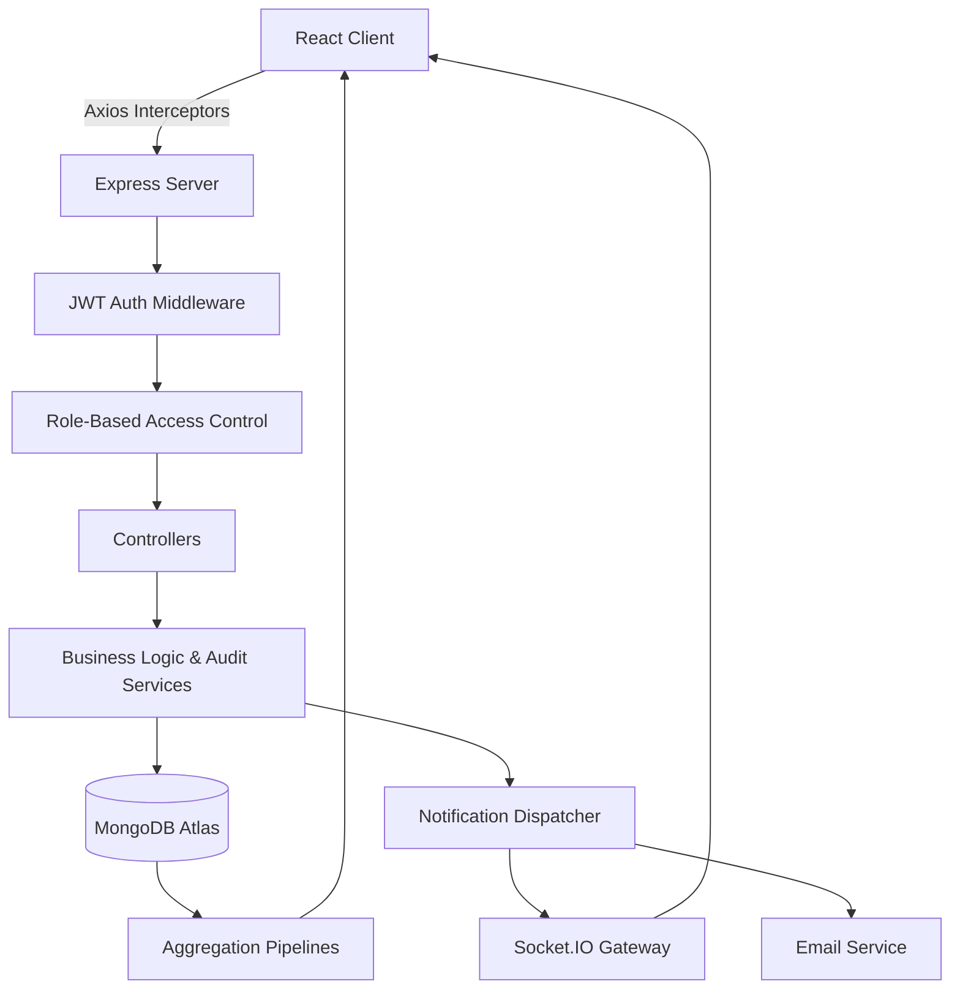

# VendorHub Enterprise Platform

<p align="center">
  <em>An enterprise-grade, high-performance Procurement Management Platform built on the MERN stack. Engineered for organization-wide scale.</em>
</p>

<p align="center">
  
  
  
  
  
  
</p>

---

## 🌟 Key Features

Highlighting true enterprise capabilities:
- **JWT Authentication & RBAC**: Secure, stateless auth with strict Role-Based Access Control (Admin, Manager, Employee).
- **Vendor Management**: Comprehensive vendor profiles with categorization and performance tracking.
- **Purchase Requests (PRs)**: Multi-stage workflows (Draft ➔ Pending ➔ Approved/Rejected).
- **Request For Quotations (RFQs)**: Direct PR linkage, multi-vendor invitations.
- **Quotations Comparison**: API-driven response simulation, allowing managers to compare pricing, delivery, and terms to award vendors.
- **Dashboard Analytics**: Live KPIs and aggregated monthly spend charts.
- **MongoDB Aggregations**: Highly optimized pipelines for real-time financial reporting.
- **Real-Time Communication Platform**: Database-backed notification engine with Socket.IO for live updates.
- **Multi-Channel Dispatcher**: Fire-and-forget notification delivery via WebSockets and Email (HTML templates).
- **Communication Management**: Advanced user preferences (opt-ins/outs by category) and Admin Broadcasts with rate-limiting.
- **Audit Logs**: Immutable tracking of all CRUD events and Admin Broadcasts (who, what, when, IP).
- **Global Search**: System-wide unified search.
- **Docker Orchestration**: Complete containerization for predictable environments.
- **CI/CD & Automated Testing**: Full GitHub Actions pipeline with Jest/Vitest test suites.

---

## 🏗️ Architecture



### Architecture Decisions
- **Why MongoDB?**: Flexible schema design supports dynamic quotation structures and varied vendor metadata. Aggregation pipelines allow real-time KPI calculations without heavy ETL processes.
- **Why RBAC?**: Procurement requires strict separation of duties (requesters vs. approvers). Middleware enforcement prevents privilege escalation.
- **Why Audit Logs?**: Enterprise compliance (e.g., SOX) dictates that every financial modification must be traceable to a specific user and timestamp.

---

## 📂 Folder Structure

```text
vendorhub-enterprise-platform/
├── client/                     # React Frontend (Vite)
│   ├── src/
│   │   ├── api/                # Axios interceptors & API modules
│   │   ├── components/         # Reusable atomic UI components
│   │   ├── features/           # Feature-based pages (Auth, Dashboard)
│   │   └── App.jsx             # React Router definitions
│   └── vite.config.js          
├── server/                     # Express Backend
│   ├── src/
│   │   ├── controllers/        # Request handlers
│   │   ├── middleware/         # Auth guards, error handling
│   │   ├── models/             # Mongoose schemas (indexes applied)
│   │   ├── routes/             # Express routes
│   │   ├── services/           # Decoupled business logic
│   │   └── app.js              # Server configuration
│   └── package.json            
└── docker-compose.yml          # Container orchestration
```

---

## 💻 Technology Stack

- **Frontend**: React 18, Vite, React Router v6, Recharts, Tailwind CSS v4, Lucide Icons.
- **Backend**: Node.js, Express.js, Socket.IO.
- **Database**: MongoDB (Mongoose ODM).
- **Testing**: Jest, Supertest (Backend), Vitest, React Testing Library (Frontend).
- **DevOps**: Docker, Docker Compose, GitHub Actions.
- **Deployment**: Vercel (Frontend), Render (Backend), MongoDB Atlas (Database).

---

## 📸 Screenshots

*(Replace placeholders with actual embedded images after deploying/capturing)*

| Landing Page | Dashboard |
|---|---|
|  |  |

| Vendor Management | Audit Logs |
|---|---|
|  |  |

---

## 🚀 Quick Start

### 1. Run with Docker (Recommended)

```bash
git clone https://github.com/yourusername/vendorhub-enterprise-platform.git
cd vendorhub-enterprise-platform

# Start the full stack (Frontend, Backend, Database)
docker compose up --build
```
- **Frontend**: `http://localhost`
- **Backend API**: `http://localhost:5000/api/v1`

### 2. Manual Installation

**Prerequisites**: Node.js (v18+) and MongoDB.

```bash
# Setup Backend
cd server
cp .env.example .env # Configure your MongoDB URI and JWT Secret
npm install
npm run dev

# Setup Frontend (In a new terminal)
cd client
cp .env.example .env
npm install
npm run dev
```

---

## 🔌 API Overview

| Endpoint | Method | Description | Role Required |
|----------|--------|-------------|---------------|
| `/api/v1/auth/login` | POST | Authenticate user | Public |
| `/api/v1/vendors` | GET | List all vendors | Manager, Admin |
| `/api/v1/purchase-requests`| POST | Create new PR | Employee, Manager |
| `/api/v1/rfqs` | POST | Dispatch RFQ | Manager, Admin |
| `/api/v1/quotations/:id/award` | POST | Award quotation | Manager, Admin |
| `/api/v1/dashboard/kpis` | GET | Fetch system KPIs | Any authenticated |
| `/api/v1/notifications/broadcast` | POST | Send system-wide broadcast | Admin |

---

## 🛡️ Security

- **JWT**: Stateless, short-lived tokens stored securely via interceptors.
- **Helmet**: Enforces strict HTTP security headers (XSS protection, no-sniff).
- **Rate Limiting**: Brute-force protection on authentication and profile routes (max 20 req/15min).
- **Password Hashing**: Bcrypt with optimized salt rounds.
- **RBAC**: Multi-tier permission verification on every protected route.
- **Regex Escaping**: Prevents Regular Expression Denial of Service (ReDoS) on search endpoints.
- **Audit Logs**: Immutable database records for all CUD (Create, Update, Delete) operations.

---

## 🧪 Testing

Comprehensive suites ensure platform stability.

**Backend Testing (Jest & Supertest)**:
```bash
cd server
npm test
```
*Covers unit logic and API integration (Authentication, RBAC enforcement, CRUD workflows).*

**Frontend Testing (Vitest & RTL)**:
```bash
cd client
npm test
```
*Covers component rendering, routing guards, and UI interactions.*

---

## 🐳 Docker Orchestration

The application is fully containerized for seamless deployment.

```bash
docker compose up --build
```

**Containers Explained**:
- `mongodb`: Official Mongo 6.0 image with persistent volume mapping (`mongo-data`). Includes health checks.
- `backend`: Multi-stage Node.js build. Depends on MongoDB health. Serves the API on port 5000.
- `frontend`: Multi-stage build compiling Vite assets and serving them via a lightweight Nginx container on port 80.

---

## ⚠️ Known Limitations

- **Email Notifications**: Currently simulated. Real SMTP integration (e.g., SendGrid/AWS SES) is required for production RFQ dispatches.
- **File Uploads**: Attachments for Quotations are not yet supported; relies on text/URL fields.
- **Localization**: System is currently English-only.

---

## 🗺️ Future Roadmap (v1.2.0)

- [ ] Background Queues (BullMQ / RabbitMQ) for reliable notification retries.
- [ ] Read Analytics and Delivery Tracking for Admin Broadcasts.
- [ ] Vendor Compliance Portal (AWS S3 Document Uploads).
- [ ] Push Notifications & PWA Support.

---
*VendorHub Enterprise Platform — Release v1.1.0*
